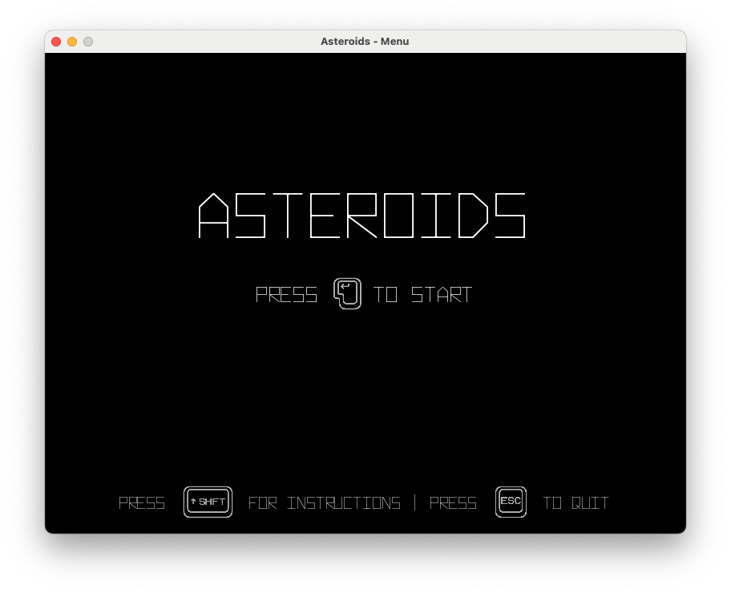
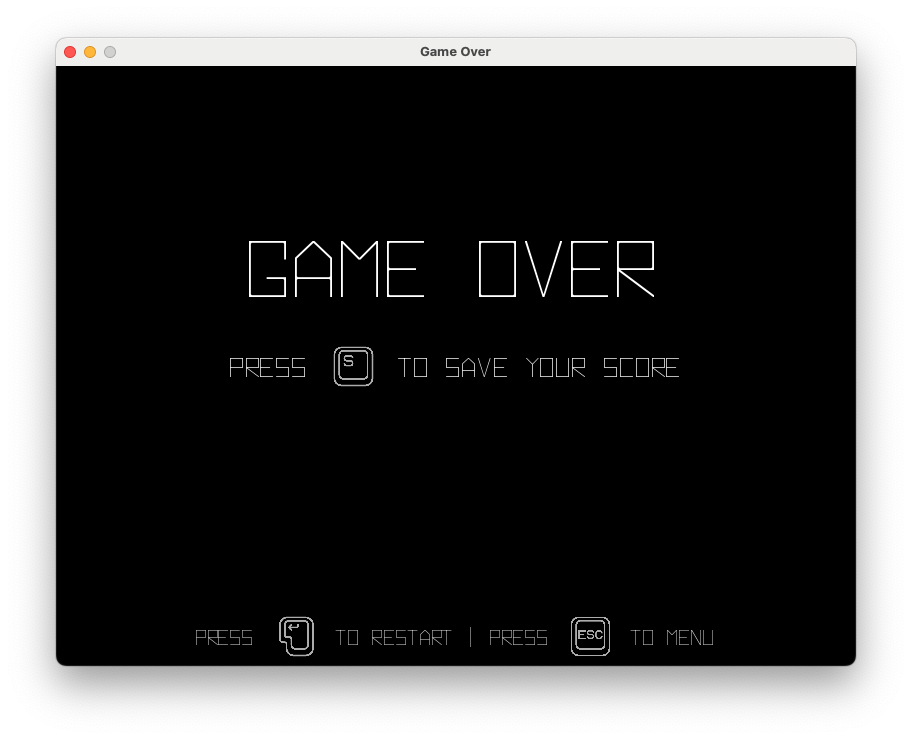

# Asteroids

A Python remake of the classic 1979 Atari arcade game, built with Pygame.


---

## Table of Contents

- [About](#about)
- [Features](#features)
- [Requirements](#requirements)
- [Installation](#installation)
- [How to Play](#how-to-play)
- [Controls](#controls)
- [Project Structure](#project-structure)
- [Configuration](#configuration)
- [Testing](#testing)
- [Troubleshooting](#troubleshooting)
- [Contributing](#contributing)
- [License](#license)
- [Acknowledgments](#acknowledgments)

---

## About

This project is a recreation of the legendary **Asteroids** arcade game, originally released by Atari in 1979. Built entirely in Python using the Pygame library, this remake captures the essence of the original while incorporating modern code practices and cross-platform support.

The player controls a spaceship navigating through an asteroid field, destroying asteroids while avoiding collisions. Larger asteroids split into smaller fragments when hit, creating an increasingly challenging gameplay experience.

> **Disclaimer:** This is a fan-made remake for educational and portfolio purposes. It is not affiliated with or endorsed by Atari.

---

## Features

- **Classic Gameplay** — Faithful recreation of the original 1979 Asteroids mechanics
- **Lives System** — Start with 3 lives, respawn with temporary invulnerability
- **UFO Enemies** — Flying saucers appear and shoot at the player (small and large variants)
- **Hyperspace Jump** — Emergency teleport to a random location (risky but useful)
- **Beat Sound System** — Iconic heartbeat rhythm that speeds up as the game intensifies
- **Score System** — Earn points by destroying asteroids and UFOs
- **High Score Saving** — Save your scores with your name
- **Delta-Time Physics** — Frame-rate independent movement for consistent gameplay
- **Pause Function** — Pause and resume gameplay at any time
- **Sound Effects** — Retro-style sound effects for shooting
- **Intro Video** — Optional Atari-style intro animation
- **Colorful Asteroids** — Randomly colored asteroids for visual variety
- **Multiple Screens** — Main menu, instructions, gameplay, and game over screens
- **Cross-Platform** — Compatible with Windows, macOS, and Linux

---

## Requirements

| Dependency | Version |
|------------|---------|
| Python | 3.10 or higher |
| Pygame | 2.6 or later |
| moviepy | Optional (for intro video) |

---

## Installation

### 1. Clone the Repository

```bash
git clone https://github.com/yourusername/asteroids-pygame.git
cd asteroids-pygame
```

### 2. Create a Virtual Environment (Recommended)

**Windows:**
```bash
python -m venv .venv
.venv\Scripts\activate
```

**macOS / Linux:**
```bash
python3 -m venv .venv
source .venv/bin/activate
```

### 3. Install Dependencies

```bash
pip install -r requirements.txt
```

Or install manually:
```bash
pip install pygame
pip install moviepy  # Optional: for intro video
```

---

## How to Play

### Starting the Game

From the repository root directory, run:

```bash
python Program.py
```

### Gameplay

1. Press `ENTER` at the main menu to start
2. Navigate your spaceship using the arrow keys
3. Press `SPACE` to shoot asteroids and earn points
4. Avoid asteroids and UFO fire — you have 3 lives
5. Use `SHIFT` for hyperspace jump when surrounded
6. Watch out for UFOs — they appear after 1000 points
7. Save your score at the game over screen

### Scoring

| Target | Points |
|--------|--------|
| Large Asteroid | 20 |
| Medium Asteroid | 50 |
| Small Asteroid | 100 |
| Large UFO | 200 |
| Small UFO | 1000 |

### Tips

- You have 3 lives — use them wisely
- Asteroids and your ship wrap around the screen edges
- Larger asteroids split into two smaller ones when destroyed
- Your ship has inertia — use momentum to your advantage
- Press `SHIFT` for hyperspace — you'll teleport randomly (risky but useful when cornered)
- UFOs appear after 1000 points — small ones are accurate, large ones shoot randomly
- The heartbeat sound speeds up as the action intensifies
- Press `ALT` to pause the game

---

## Controls

| Action | Key |
|--------|-----|
| Move Forward | Up Arrow |
| Rotate Left | Left Arrow |
| Rotate Right | Right Arrow |
| Shoot | Space |
| Hyperspace (Teleport) | Shift |
| Pause / Resume | Alt |
| Show Instructions | Shift (menu only) |
| Save Score | S (game over screen) |
| Go Back / Quit | Escape |
| Start Game | Enter (menu) |
| Restart Game | Enter (game over screen) |

---

## Project Structure

```
asteroids-pygame/
├── Program.py              # Main entry point
├── requirements.txt        # Python dependencies
├── scores.txt              # Saved high scores
├── README.md               # Documentation
├── LICENSE                 # MIT License
├── CONTRIBUTING.md         # Contribution guidelines
├── .gitignore              # Git ignore rules
│
├── logic/                  # Core game logic
│   ├── __init__.py
│   ├── Game.py             # Main game loop and state management
│   ├── GameObject.py       # Abstract base class for game entities
│   ├── Spaceship.py        # Player-controlled spaceship
│   ├── Asteroid.py         # Destructible asteroid objects
│   ├── Bullet.py           # Projectiles fired by the player
│   └── Collision.py        # Collision detection utilities
│
├── ui/                     # User interface screens
│   ├── __init__.py
│   ├── Menu.py             # Main menu with intro video
│   ├── Instructions.py     # Controls and help screen
│   └── EndScreen.py        # Game over screen with score saving
│
├── utils/                  # Utility modules
│   ├── __init__.py
│   ├── Constants.py        # Game configuration and constants
│   └── Resource_Loader.py  # Asset loading with error handling
│
├── assets/                 # Game assets
│   ├── fonts/              # Custom game fonts
│   ├── sounds/             # Sound effects
│   ├── keys/               # Keyboard key images for UI
│   ├── screenshots/        # Game screenshots
│   └── atari.mp4           # Optional intro video
│
└── tests/                  # Unit tests
    ├── __init__.py
    ├── test_collision.py   # Collision detection tests
    └── test_constants.py   # Constants validation tests
```

---

## Screenshots

| Main Menu | Gameplay | Game Over |
|:---------:|:--------:|:---------:|
|  |  |  |

---

## Configuration

Game settings can be adjusted in `utils/Constants.py`:

```python
# Screen dimensions
SCREEN_WIDTH = 800
SCREEN_HEIGHT = 600

# Game settings
FPS = 60
ASTEROID_SPAWN_INTERVAL = 3000  # milliseconds

# Spaceship settings
SPACESHIP_ACCELERATION = 0.2
SPACESHIP_FRICTION = 0.99
SPACESHIP_ROTATION_SPEED = 5
```

---

## Testing

Run the full test suite:

```bash
python -m pytest tests/
```

Run tests with verbose output:

```bash
python -m pytest tests/ -v
```

---

## Troubleshooting

### Game won't start

1. Verify Python 3.10+ is installed: `python --version`
2. Confirm Pygame is installed: `pip show pygame`
3. Ensure you are running from the project root directory
4. Check the console for error messages

### No sound

- Verify your system audio is working
- Check that sound files exist in `assets/sounds/`
- The game will continue without sound if files are missing

### Intro video doesn't play

- moviepy is optional — the game functions without it
- Install moviepy: `pip install moviepy`
- Verify `assets/atari.mp4` exists

### Assets not loading

- Always run from the project root: `python Program.py`
- Do not run from inside subdirectories
- Check console output for specific error messages

---

## Contributing

Contributions are welcome. Please see [CONTRIBUTING.md](CONTRIBUTING.md) for guidelines.

### Quick Start

1. Fork the repository
2. Create a feature branch: `git checkout -b feature/your-feature`
3. Commit your changes: `git commit -m 'Add your feature'`
4. Push to the branch: `git push origin feature/your-feature`
5. Open a Pull Request

---

## License

This project is licensed under the MIT License. See the [LICENSE](LICENSE) file for details.

---

## Acknowledgments

- **Atari** — For creating the original Asteroids game (1979)
- **Pygame** — For the game development library
- **Ed Logg & Lyle Rains** — Original Asteroids game designers

---

## Author

**Kfir Moscovich**

- GitHub: [@yourusername](https://github.com/yourusername)
- LinkedIn: [Your Profile](https://linkedin.com/in/yourprofile)

